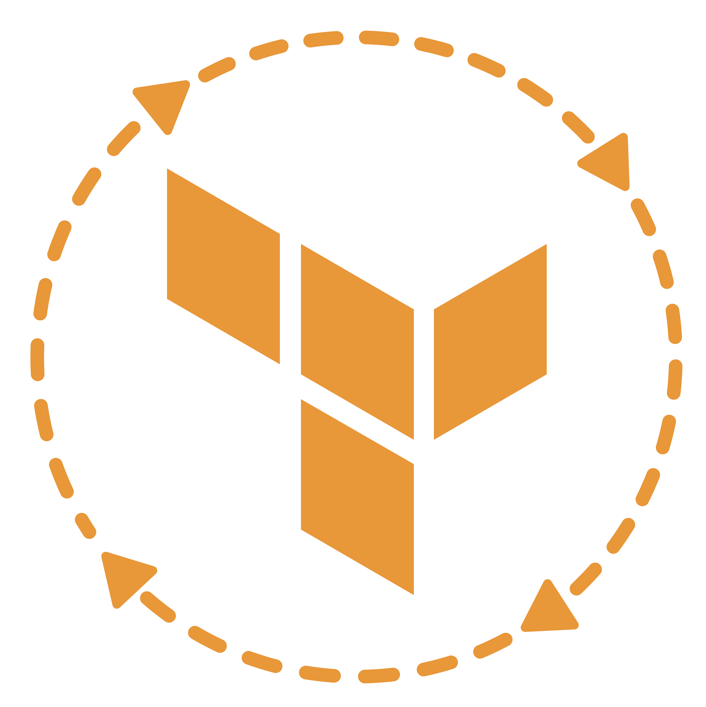
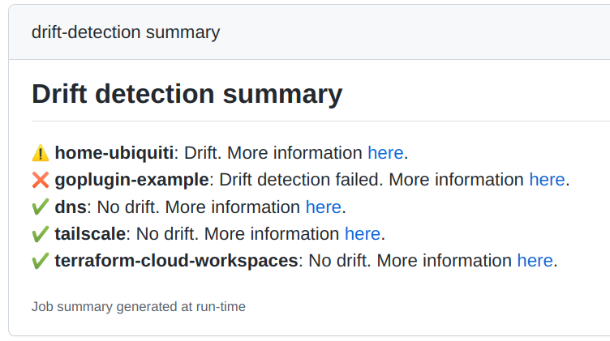

<p align="center">
    
</p>

# tfe-drift

[](https://github.com/slok/tfe-drift/actions/workflows/ci.yaml)
[](https://goreportcard.com/report/github.com/slok/tfe-drift)
[](https://raw.githubusercontent.com/slok/tfe-drift/master/LICENSE)
[](https://github.com/slok/tfe-drift/releases/latest)

## Introduction

Automated Terraform Cloud/Enterprise drift detection.

## Features

- Automate the execution of drift detection plans.
- Limit executed drift detection plans (used to avoid long plan queues with available workers).
- Sort drift detection plans by previous detections age.
- Filter drift detections by workspace.
- Ignore if drift detection plan not required (already running, executed recently...)
- Result of the detection plans summary as output to automate with other apps.
- Easy to automate with CI (It comes with a ready to use [Github action][tfe-drift-gh-actions]).
- Compatible with Terraform Cloud and Terraform Enterprise.
- Easy and simple to use.

## Getting started

2 variables are required by default:

- Terraform cloud/enterprise API token: Use `--tfe-token` or `TFE_DRIFT_TFE_TOKEN` env var.
- Terraform cloud/enterprise organization: Use `--tfe-organization` or `TFE_DRIFT_TFE_ORGANIZATION` env var.

```bash
tfe-drift run --limit-max-plan 5
```

## Usage

### Binary

Get the binary from the [releases](https://github.com/slok/tfe-drift/releases) first.

Execute in dry run mode to see what would be the workspaces affected:

```bash
tfe-drift run --dry-run
```

Execute with safe defaults and get the result output in JSON:

```bash
tfe-drift run -o json
```

Limit to a max of 2 executed plans, ignore workspace drift detections that have been already executed in the last 2h, and exclude dns workspace:

```bash
tfe-drift run --exclude dns --not-before 2h --limit-max-plan 2
```

### Docker

You can use the released [docker images](https://github.com/slok/tfe-drift/pkgs/container/tfe-drift).

```bash
docker run --rm -it -e TFE_DRIFT_TFE_TOKEN=${TFE_DRIFT_TFE_TOKEN} ghcr.io/slok/tfe-drift:v0.1.0 run --help
```

### Github actions

You can use [tfe-drift github action][tfe-drift-gh-actions]

```yaml
name: drift-detection

on:
  schedule:
    - cron:  '0 * * * *' # Every hour.

jobs:
  drift-detection:
    runs-on: ubuntu-latest
    steps:
      - uses: slok/tfe-drift-action@v0.1.0
        id: tfe-drift
        with:
          tfe-token: ${{ secrets.TFE_TOKEN }}
          tfe-org: slok
          limit-max-plans: 3 # Avoid queuing lots of speculative plans.
          not-before: 24h # A drift detection per day it's enough.
```

Github action will write a job summary with the executed drift detections results:



## F.A.Q

### How is a drift detection executed?

It's a terraform [speculative plan](https://developer.hashicorp.com/terraform/cloud-docs/run/remote-operations#speculative-plans) using the configured latest terraform workspace source code (normally `main` branch on the specified repository and directory).

### How does it work?

When tfe-drift is executed it runs with an specific identifier (`--app-id`, by default `tfe-drift`).

All the drift detections that tfe-drift runs using TFE API, will be identified by this ID on the plan message.

From now on, it will use this ID to get the workspaces drift detection plans and use these information to decide the result or if needs to run again or not on next executions.

If the executed drift detection terraform plan has changes, its a drift!

### Why? Hashicorp recently announced [Drift detection][drift-detection]

Terraform cloud offers it's own [drift detector][drift-detection](Looks awesome!), however, this feature it's not available for non "Business" tiers.

### Why limit the plans?

Sometimes Terraform cloud execution workers are busy or you have a few of them (even 1!). To avoid filling a huge queue with drift detections and block Terraform cloud usage... you can use the limit pattern:

Limit per execution and schedule multiple tfe-drift runs over the day. The result would be the same as without limiting except blocking your Terraform cloud workers for hours: At the end of the day, all your workspaces have been checked.

### How does tfe-drift schedule drift detections?

Using a combination of different strategies:

- Don't run already running/queued drift detection runs.
- Don't run the workspaces where the drift detections has been executed in the last T time (e.g: 12h).
- Prioritizing the workspaces with oldest drift detections or without previous ones.

### Can be used with CI and crons (e.g: github action)?

You should! :) You even have a ready to use [github action][tfe-drift-gh-actions].

It has been designed with that in mind:

Having a cron job that executes tfe-drift regularly (e.g 1h) with a limited number of plans at the same time.

At the end of the day, all your workspaces should have been checked. tfe-drift will handle the scheduling logic so it's safe to be run at regular intervals.

It will return a json output summary so you can use it to notify or extend with other CI steps or actions.

### Exit codes?

- `0`: If everything is as it should.
- `1`: If there was an error executing tfe-drift.
- `2`: If there was any drift.
- `3`: If there was any error on a drift detection plan.

Optionally you can disable 2 and 3 exit codes in case you want to handle the drif/detection errors with the JSON summary by pipelining other applications or scripting.

### Output formats?

By default, only the logger information will be written, however you can use `-o` to select an output format, the ones available are:

- `json`: Non-indenten JSON.
- `pretty-json`: Indented JSON.

### Result JSON format?

Look at this example:

```json
{
        "workspaces": {
                "wk1": {
                        "name": "wk1",
                        "id": "ws-RAB2YhfV7mpXUTW1",
                        "drift_detection_run_id": "run-BQHxAamo7pSi1iMf",
                        "drift_detection_run_url": "https://app.terraform.io/app/user1/workspaces/wk1/runs/run-BQHxAamo7pSi1iMf",
                        "drift": false,
                        "drift_detection_plan_error": false
                },
                "wk2": {
                        "name": "wk2",
                        "id": "ws-vz46xzDKYWpfa5o8",
                        "drift_detection_run_id": "run-8AgmNBY2MfKeyjGt",
                        "drift_detection_run_url": "https://app.terraform.io/app/user1/workspaces/wk2/runs/run-8AgmNBY2MfKeyjGt",
                        "drift": false,
                        "drift_detection_plan_error": false
                },
                "wk3": {
                        "name": "wk3",
                        "id": "ws-qaCmR6EL8fujrxxY",
                        "drift_detection_run_id": "run-ndhST1LXMh7tn3L5",
                        "drift_detection_run_url": "https://app.terraform.io/app/user1/workspaces/wk3/runs/run-ndhST1LXMh7tn3L5",
                        "drift": true,
                        "drift_detection_plan_error": false
                },
                "wk4": {
                        "name": "wk4",
                        "id": "ws-df3PN4CX3grHghE9",
                        "drift_detection_run_id": "run-Nwy7911XPX4qcwWu",
                        "drift_detection_run_url": "https://app.terraform.io/app/user1/workspaces/wk4/runs/run-Nwy7911XPX4qcwWu",
                        "drift": false,
                        "drift_detection_plan_error": false
                }
        },
        "drift": true,
        "drift_detection_plan_error": false,
        "created_at": "2022-11-14T17:59:55.946884748Z"
}
```

[drift-detection]: https://www.hashicorp.com/campaign/drift-detection-for-terraform-cloud
[tfe-drift-gh-actions]: https://github.com/marketplace/actions/terraform-cloud-enterprise-drift-detection
